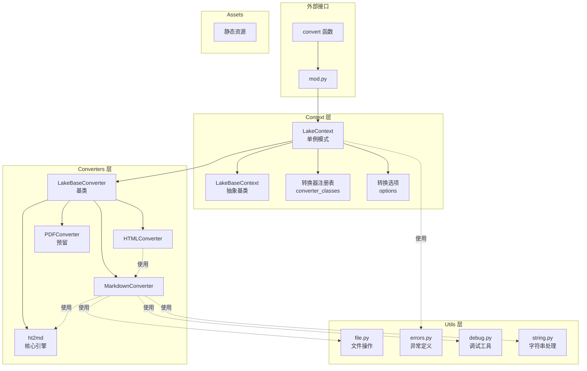
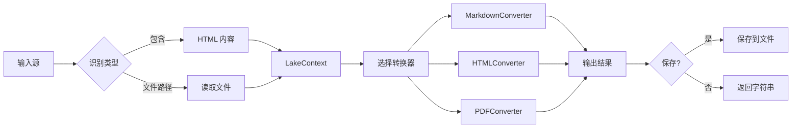
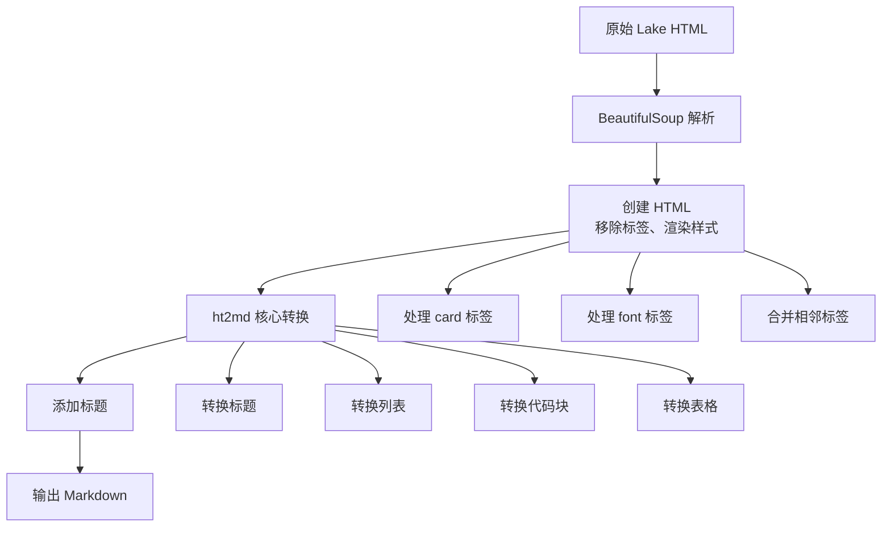

# LakeDoc 架构文档

## 概述

LakeDoc 是一个用于将语雀（Yuque）Lake 文档转换为多种格式的 Python 库。项目采用分层架构设计，通过上下文管理、转换器注册和插件化扩展机制，实现了灵活的文档转换功能。

## 项目结构

```
lakedoc/
├── src/
│   ├── main.py                 # 程序入口
│   └── lakedoc/
│       ├── __init__.py         # 模块初始化，对外 API
│       ├── assets/             # 静态资源
│       │   └── doc-type-default.svg
│       ├── context/            # 上下文管理层
│       │   ├── __init__.py
│       │   ├── base.py         # 上下文抽象基类
│       │   ├── lake.py         # Lake 上下文实现
│       │   └── mod.py          # 外部接口模块
│       ├── converters/         # 转换器层
│       │   ├── __init__.py
│       │   ├── base.py         # 转换器基类
│       │   ├── md_converter.py # Markdown 转换器
│       │   ├── html_converter.py # HTML 转换器
│       │   ├── pdf_converter.py # PDF 转换器（预留）
│       │   └── ht2md/          # 核心 HTML 到 Markdown 转换引擎
│       │       ├── __init__.py
│       │       ├── converter.py
│       │       └── converter.pyi
│       └── utils/              # 工具模块
│           ├── __init__.py
│           ├── debug.py        # 调试工具
│           ├── errors.py       # 异常定义
│           ├── file.py         # 文件操作
│           └── string.py       # 字符串处理
├── docs/                       # 文档目录
│   ├── imgs/
│   │   └── logo.png
│   └── architecture.md         # 本文档
├── tests/                      # 测试目录
├── issues/                     # 问题追踪
├── pyproject.toml              # 项目配置
├── README.md                   # 项目说明
└── LICENSE                     # 许可证
```

## 核心架构

### 架构图



### 1. 上下文管理层（Context）

上下文管理层负责协调整个转换流程，管理转换器的注册和选择。

#### LakeBaseContext（抽象基类）

定义了上下文的核心接口：

- `register(converter, converter_class, is_cover)` - 注册转换器
- `pick(converter)` - 选择指定的转换器
- `convert_content(html, converter)` - 转换 HTML 内容
- `convert_content_save(html, save_path, converter, encoding)` - 转换并保存
- `convert_file(read_path, converter, encoding)` - 转换文件
- `convert_file_save(read_path, save_path, converter, encoding)` - 转换文件并保存

#### LakeContext（具体实现）

- 采用**单例模式**，确保全局只有一个上下文实例
- 维护转换器注册表 `converter_classes`
- 管理转换选项 `options`
- 从全局注册表 `_converter_registry` 自动注册转换器

#### mod.py（外部接口）

提供统一的 `convert()` 函数，自动识别输入类型（文件路径或 HTML 内容）并路由到相应的转换方法。

### 2. 转换器层（Converters）

转换器层负责实际的格式转换，采用策略模式和注册表模式实现扩展性。

#### LakeBaseConverter（转换器基类）

所有转换器的基类，提供：

- `name` - 转换器名称（强制字段）
- `suffix` - 输出文件后缀（强制字段）
- `convert()` - 抽象转换方法，子类必须实现

**自动注册机制**：通过 `__init_subclass__` 钩子，子类定义时自动注册到全局注册表和上下文。

#### MarkdownConverter

HTML 到 Markdown 的转换器，特性：

- 基于 `ht2md` 核心转换引擎
- 支持语雀特有的 `<card>` 标签转换
- 处理样式（颜色、缩进等）
- 合并相邻的 `<em>` 和 `<strong>` 标签以避免二义性
- 支持多种 Markdown 语法（标题、列表、代码块、表格、数学公式等）

**自定义转换方法**：
- `convert_card()` - 转换语雀卡片组件（hr、image、table、codeblock、diagram、math、yuqueinline 等）
- `convert_font()` - 保留颜色样式
- `convert_li()` - 支持缩进列表

#### HTMLConverter

HTML 到 HTML 的转换器，实现路径：`Lake HTML -> Markdown -> Standard HTML`

- 使用 `MarkdownConverter` 进行中间转换
- 使用 `markdown` 库将 Markdown 转换为标准 HTML
- 包装完整的 HTML 文档结构（包含 CSS 样式）

#### PDFConverter

PDF 转换器（预留），计划实现路径：`Lake HTML -> Markdown -> HTML -> PDF`

#### ht2md 模块

核心 HTML 到 Markdown 转换引擎，提供：

- `MarkdownConverter` 类 - 核心转换器
- `Options` 数据类 - 转换选项配置
- 丰富的标签转换方法（`convert_a`、`convert_hN`、`convert_p`、`convert_table` 等）
- 支持多种 Markdown 扩展语法

### 3. 工具模块（Utils）

#### file.py

文件操作工具：

- `readfile(path, encoding)` - 读取文件内容
- `savefile(content, path, encoding, suffix)` - 保存内容到文件

#### errors.py

异常定义：

- `LakeBaseError` - 基础异常类
- `LakeFileNotFoundError` - 文件不存在异常
- `LakeIsNotFileError` - 路径非文件异常
- `LakeContentTypeError` - 类型错误异常
- `LakeContextError` - 上下文错误基类
- `LakePickNotFoundError` - 转换器未找到异常
- `LakeSourceEmptyError` - 源内容为空异常
- `LakeBuilderNotFoundError` - 解析器未找到异常

#### debug.py

调试工具：

- `enable_debug()` - 启用全局调试模式
- `disable_debug()` - 禁用全局调试模式
- `debug(message, level, color)` - 输出调试信息
- `debug_section(title)` - 输出章节标题
- `debug_subsection(title)` - 输出子章节标题
- `is_debug_enabled()` - 检查调试模式状态

#### string.py

字符串处理工具：

- `color_string(text, color)` - 带颜色的字符串输出
- `extract_integer(text)` - 从字符串中提取整数
- `decode_card_value(value)` - 解码卡片值

## 数据流

### 转换流程图



### Markdown 转换详细流程



## 设计模式

1. **单例模式** - `LakeContext` 确保全局唯一实例
2. **策略模式** - 通过 `converter` 参数选择不同的转换策略
3. **注册表模式** - 转换器自动注册机制
4. **模板方法模式** - `LakeBaseConverter` 定义转换流程框架
5. **工厂模式** - `LakeContext.pick()` 根据名称创建转换器实例

## 扩展性

### 添加新转换器

```python
from lakedoc.converters import LakeBaseConverter

class MyConverter(LakeBaseConverter):
    name = "myformat"
    suffix = ".myfmt"

    def __init__(self, raw_html: str, **options):
        self.raw_html = raw_html
        # 初始化逻辑

    def convert(self) -> str:
        # 转换逻辑
        return "converted content"
```

### 注册自定义转换器

```python
import lakedoc

# 自动注册（通过继承 LakeBaseConverter）
# 或手动注册
lakedoc.context.register('custom', MyConverter)

# 使用
lakedoc.convert('./input.html', converter='custom')
```

## 依赖关系

```
lakedoc
├── beautifulsoup4 (HTML 解析)
├── colorama (终端颜色输出)
├── markdown (Markdown 到 HTML 转换)
└── pymdown-extensions (Markdown 扩展)
```

